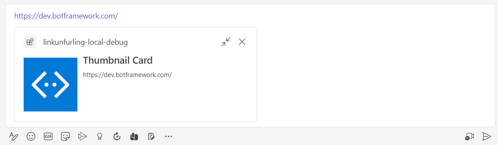
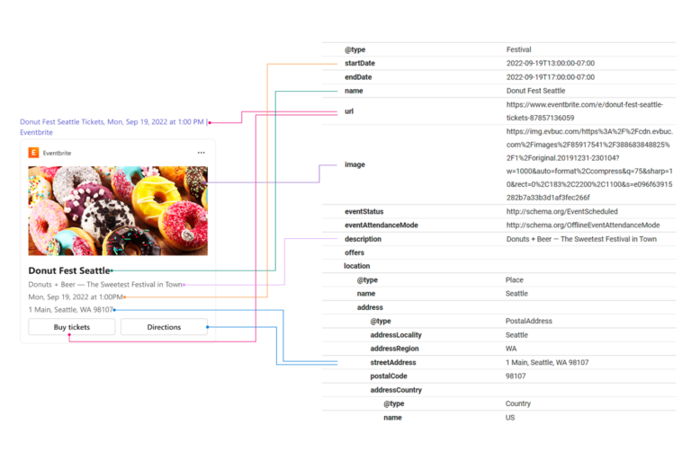

# Link Unfurling Investigation

## Work flow

- Add the messageHandlers array to your app manifest
```json
"composeExtensions": [
  {
    "botId": "abc123456-ab12-ab12-ab12-abcdef123456",
    "messageHandlers": [
      {
        "type": "link",
        "value": {
          "domains": [
            "*.trackeddomain.com"
          ]
        }
      }
    ]
  }
],
```

- Handle the composeExtension/queryLink invoke in bot endpoint
```ts
public async handleTeamsAppBasedLinkQuery(context: TurnContext, query: any): Promise<any> {
  const attachment = CardFactory.thumbnailCard('Thumbnail Card',
    query.url,
    ['https://raw.githubusercontent.com/microsoft/botframework-sdk/master/icon.png']);

  const result = {
    attachmentLayout: 'list',
    type: 'result',
    attachments: [attachment]
  };

  const response = {
    composeExtension: result
  };
  return response;
}
```




## App-less link unfurling
One of the features of link unfurling is the adoption of schema.org – if a URL has attached metadata as specified, Teams is able to match that to a pre-defined card template and then render a card when a link is displayed in the client. Here’s an example of how this works:




## Zero install for link unfurling
Zero install link unfurling helps you unfurl previews for your shared links even before a user discovered or installed your app in Teams. You can anonymously unfurl cards with a new invoke request or create a pre-authenticated Adaptive Card preview for users before they install or authenticate your app.

Work flow:

- Set the property supportsAnonymizedPayloads to true in the manifest schema.
- Set your app to handle the new invoke request composeExtension/anonymousQueryLink.


Limitation:
- The zero-install link unfurling experience is governed by all Teams admin security policies, which means that if an app is blocked at the tenant level, zero-install link unfurling won’t preview it.

### Example of HTML with metadata:

```html
<div itemscope itemtype ="https://schema.org/Movie">
  <h1 itemprop="name">Avatar</h1>
  <div itemprop="director" itemscope itemtype="https://schema.org/Person">
  Director: <span itemprop="name">James Cameron</span> (born <span itemprop="birthDate">August 16, 1954</span>)
  </div>
  <span itemprop="genre">Science fiction</span>
  <a href="../movies/avatar-theatrical-trailer.html" itemprop="trailer">Trailer</a>
</div>
```

## Ideas for link unfurling as discussed
- User provider a swagger yml file with Rest API definition
  
  Example yaml file:

  ```yaml
  openapi: 3.0.0
  info: # Contains API information
    title: Sample API
    description: Optional multiline or single-line description in [CommonMark](http://commonmark.org/help/) or HTML.
    version: 0.1.9
  servers: # Specifies the API server and base URL
    - url: http://api.example.com/v1
      description: Optional server description, e.g. Main (production) server
  paths: # defines individual endpoints (paths), and the HTTP methods (operations) supported by these endpoints.
    /users/{userId}:
      get:
        summary: Returns a user by ID.
        parameters:
          - in: path
            name: userId
            required: true
            schema:
              type: integer
              format: int64
              minimum: 1
        responses:
          '200':
            description: OK
            content:
              application/json:
                schema:
                  $ref: '#/components/schemas/User'

  components:
    schemas:
      User:
        type: object
        properties:
          id:
            type: integer
            example: 4
          name:
            type: string
            example: Arthur Dent
        # Both properties are required
        required:  
          - id
          - name
  ```

- Teams Toolkit will analyze the GET operation in APIs to generate adaptive card based on GET response
  

- Generate a sample project which contains bot backend service which will show link unfurling when user input the URL 

  When user input http://api.example.com/v1/users/xxxx, it will show below link unfurling adaptive card:

   


## Some limitations
- Currently, link unfurling is not supported on Mobile clients.
- Today link unfurling must be done in the context of a message extension app which requires a bot.
- The link unfurling result is cached for 30 minutes. (Cannot find ways to remove this cache)