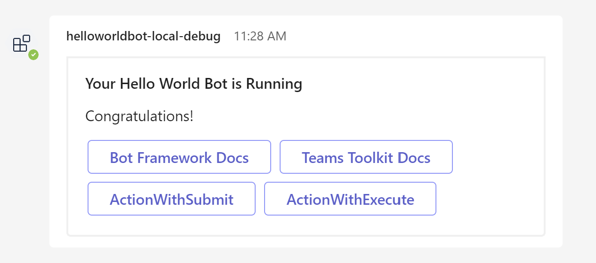

# Adaptive Card Investigation

## Introduction
Adaptive Cards are an open card exchange format using JSON enabling developers to exchange UI content in a common and consistent way.

An example: 


```json
{
  "type": "message",
  "text": "Plain text is ok, but sometimes I long for more...",
  "attachments": [
    {
      "contentType": "application/vnd.microsoft.card.adaptive",
      "content": {
        "type": "AdaptiveCard",
        "version": "1.0",
        "body": [
          {
            "type": "TextBlock",
            "text": "Hello World!",
            "size": "large"
          },
          {
            "type": "TextBlock",
            "text": "*Sincerely yours,*"
          },
          {
            "type": "TextBlock",
            "text": "Adaptive Cards",
            "separation": "none"
          }
        ],
        "actions": [
          {
            "type": "Action.OpenUrl",
            "url": "http://adaptivecards.io",
            "title": "Learn More"
          }
        ]
      }
    }
  ]
}
```

## Universal Actions for Adaptive Cards
Universal Actions for Adaptive Cards bring the bot as the common backend for handling actions and introduces a new action type, Action.Execute, which works across apps, such as Teams and Outlook.

Before the Universal Actions for Adaptive Cards, different hosts provided different action models as follows:
- Teams or bots used Action.Submit, an approach which defers the actual communication model to the underlying channel.
- Outlook used Action.Http to communicate with the backend service explicitly specified in the Adaptive Card payload.
The following image shows the current inconsistent action model:


With the Universal Actions for Adaptive Cards, you can use Action.Execute for action handling across different platforms. Action.Execute works across hubs including Teams and Outlook:


## Adaptive Card for Teams Bot
Workflow:
- Bot send adaptive Card using message attachments as below:

  

  ```json
  {
    "type": "message",
    "attachments": [
      {
        "contentType": "application/vnd.microsoft.card.adaptive",
        "content": {
            "type": "AdaptiveCard",
            "body": [
              {
                "type": "TextBlock",
                "size": "Medium",
                "weight": "Bolder",
                "text": "Your Hello World Bot is Running"
              },
              {
                "type": "TextBlock",
                "text": "Congratulations!",
                "wrap": true
              }
            ],
            "actions": [
              {
                "type": "Action.OpenUrl",
                "title": "Bot Framework Docs",
                "url": "https://docs.microsoft.com/en-us/azure/bot-service"
              },
              {
                "type": "Action.OpenUrl",
                "title": "Teams Toolkit Docs",
                "url": "https://aka.ms/teamsfx-docs"
              },
              {
                "type": "Action.Submit",
                "title": "ActionWithSubmit",
                "data": {
                  "msteams": {
                      "type": "messageBack",
                      "text": "text to bots",
                      "value": "{\"a\": \"dddd\"}"
                  }
                }
              },
              {
                "type": "Action.Execute",
                "title": "ActionWithExecute",
                "verb": "doStuff",
                "data": "ddd",
              }
            ],
            "$schema": "http://adaptivecards.io/schemas/adaptive-card.json",
            "version": "1.4"
          }
      }
    ]
  }
  ```
- If user click ActionWithSubmit button, it will send message activity to Bot backend with data defined in the adaptive card


  Activity payload: 
  ```json
  {
    "text":"text to bots",
    "type":"message",
    "value":{
        "a":"dddd"
    },
    ...
  }
  ```

  You can response it with plain message or another adaptive card:
  ```json
  {
    "type": "message",
    "text": "response message",
  }
  ```

  


- If user click ActionWithExecute button, it will send activity with name `adaptiveCard/action`

  ```ts
  if (context.activity.name === "adaptiveCard/action") { 
    // Process action
  }
  ```

  Response body: response message
  ```json
  {
    "type": "invokeResponse",
    "value":  {
      "status": 200,
      "body": {
        "statusCode": 200,
        "type": "application/vnd.microsoft.activity.message",
        "value": "my action works"
      }
    }
  }
  ```
  


  Response body: Response adaptive card
  ```json
  {
    "type": "invokeResponse",
    "value":  {
      "status": 200,
      "body": {
        "statusCode": 200,
        "type": "application/vnd.microsoft.card.adaptive",
        "value": {
          "type": "AdaptiveCard",
          "version": "1.0",
          "body": [
            {
              "type": "TextBlock",
              "text": "InvokeWorks",
              "size": "large"
            }
          ]
        }
      }
    }
  }
  ```
  


## Adaptive Card for Teams Tab
Workflow:
- User opens the Tab App, it will send `tab/fetch` to the Bot backend
  ```ts
  // When tab open
  if (context.activity.name === "tab/fetch") { 
    // send tab response with adaptive card
  }
  ```

  A sample Tab response will be as below:
  
  ```json
  {
   "tab":{
      "type":"continue",
      "value":{
         "cards":[
            {
               "card":{
                  "type":"AdaptiveCard",
                  "body":[
                     {
                        "type":"TextBlock",
                        "size":"Medium",
                        "weight":"Bolder",
                        "text":"Your Hello World Bot is Running"
                     },
                     {
                        "type":"TextBlock",
                        "text":"Congratulations! ",
                        "wrap":true
                     }
                  ],
                  "actions":[
                     {
                        "type":"Action.OpenUrl",
                        "title":"Bot Framework Docs",
                        "url":"https://docs.microsoft.com/en-us/azure/bot-service"
                     },
                     {
                        "type":"Action.OpenUrl",
                        "title":"Teams Toolkit Docs",
                        "url":"https://aka.ms/teamsfx-docs"
                     },
                     {
                        "type":"Action.Submit",
                        "title":"ActionWithSubmit",
                        "data":"dd"
                     },
                     {
                        "type":"Action.Execute",
                        "title":"ActionWithExecute",
                        "verb":"doStuff",
                        "data":"ddd"
                     }
                  ],
                  "$schema":"http://adaptivecards.io/schemas/adaptive-card.json",
                  "version":"1.4"
               }
            }
         ]
      }
   }
  }
  ```

- When user clicks `ActionWithSubmit` button, it will send `tab/submit` to the Bot backend
  ```ts
  // When click submit action button
  if (context.activity.name === "tab/submit") { 
    // send tab response with adaptive card
  }
  ```

  The payload inside activity will be as below:
  ```json
  {
   "name":"tab/submit",
   "type":"invoke",
   "value":{
      "data":{
         "a":"dddd"
      },
      "tabContext":{
         "tabEntityId":"homeTab"
      }
   },
  }
  ```

  A sample Tab response will be as below:
  
  ```json
  {
   "tab":{
      "type":"continue",
      "value":{
         "cards":[
            {
               "card":{
                  "type":"AdaptiveCard",
                  "body":[
                     {
                        "type":"TextBlock",
                        "size":"Medium",
                        "weight":"Bolder",
                        "text":"Invoke with submit"
                     }
                  ],
                  "actions":[
                     {
                        "type":"Action.OpenUrl",
                        "title":"Bot Framework Docs",
                        "url":"https://docs.microsoft.com/en-us/azure/bot-service/?view=azure-bot-service-4.0"
                     }
                  ],
                  "$schema":"http://adaptivecards.io/schemas/adaptive-card.json",
                  "version":"1.4"
               }
            }
         ]
      }
   }
  }
  ```

- Currently, Teams Tab not supported `Action.Execute`, it will show error as below:

  

## Adaptive Card in Message extension
Workflow:
- Message extension can define a custom adaptive card to collect the user input. For this approach, set the fetchTask parameter to true in the manifest. If you set, fetchTask to true any static parameters defined for the command will be ignored. It will send `composeExtension/fetchTask` to backend Bot to request a custom adaptive card.

  ```json
    "composeExtensions": [
      {
        "botId": "{{state.fx-resource-bot.botId}}",
        "commands": [
          {
              "id": "createCard",
              "context": [
                  "compose"
              ],
              "description": "Command to run action to create a Card from Compose Box",
              "title": "Create Card",
              "type": "action",
              "fetchTask": true
          }
          ...
        ]
        ...
      },
    ]
  ```

- Bot backend response body will be as below (for message extension, Action.Execute is not work, if the response body contains Action.Execute action, then it will render nothing):

  ```json
  {
    "task": {
        "type": "continue",
        "value": {
            "card": {
                "contentType": "application/vnd.microsoft.card.adaptive",
                "content":{
                  "type": "AdaptiveCard",
                  "body": [
                    {
                      "type": "TextBlock",
                      "size": "Medium",
                      "weight": "Bolder",
                      "text": "Your Hello World Bot is Running"
                    },
                    {
                      "type": "TextBlock",
                      "text": "Congratulations!",
                      "wrap": true
                    }
                  ],
                  "actions": [
                    {
                      "type": "Action.OpenUrl",
                      "title": "Bot Framework Docs",
                      "url": "https://docs.microsoft.com/en-us/azure/bot-service"
                    },
                    {
                      "type": "Action.OpenUrl",
                      "title": "Teams Toolkit Docs",
                      "url": "https://aka.ms/teamsfx-docs"
                    },
                    {
                      "type": "Action.Submit",
                      "title": "ActionWithSubmit",
                      "data": {
                        "msteams": {
                            "type": "messageBack",
                            "text": "text to bots",
                            "value": "{\"a\": \"dddd\"}"
                        }
                      }
                    }
                  ],
                  "$schema": "http://adaptivecards.io/schemas/adaptive-card.json",
                  "version": "1.4"
                }
            }
        }
    }
  }
  ```
  

- When user click `ActionWithSubmit` button, it will send `composeExtension/submitAction` to the Bot backend with the request body as below:

  ```json
  {
    "commandId":"createCard",
    "commandContext":"compose",
    "requestId":"962f6e8b-011b-4994-973b-b5cf3b2396ba",
    "context":{
        "theme":"default"
    },
    "data":{
        "msteams":{
          "type":"messageBack",
          "text":"text to bots",
          "value":"{\"a\": \"dddd\"}"
        }
    }
  }
  ```

- And Bot endpoint will response as below:
  ```json
  {
    "task": {
      "type": "continue",
      "value": {
          "card": {
              "contentType": "application/vnd.microsoft.card.adaptive",
              "content":{
                "type":"AdaptiveCard",
                "body":[
                    {
                      "type":"TextBlock",
                      "size":"Medium",
                      "weight":"Bolder",
                      "text":"Invoke with submit"
                    }
                ],
                "actions":[
                    {
                      "type":"Action.OpenUrl",
                      "title":"Bot Framework Docs",
                      "url":"https://docs.microsoft.com/en-us/azure/bot-service/?view=azure-bot-service-4.0"
                    }
                ],
                "$schema":"http://adaptivecards.io/schemas/adaptive-card.json",
                "version":"1.4"
              }
          }
      }
    }
  }
  ```
  


## Adaptive Card in pure HTML

- Import Adaptive card render library
  ```html
  <script src="https://unpkg.com/adaptivecards/dist/adaptivecards.js"></script>
  ```

- Add adaptive card payload
  ```js
  // Create an AdaptiveCard instance
  let adaptiveCard = new AdaptiveCards.AdaptiveCard();
  // Parse a card payload - this is just a very simple example
  adaptiveCard.parse(
      {
        "type": "AdaptiveCard",
        "version": "1.0",
        "body": [
          {
            "type": "TextBlock",
            "size": "Medium",
            "weight": "Bolder",
            "text": "Card Sample"
          }
        ],
        "actions": [
          {
            "type": "Action.Submit",
            "id": "clickMe",
            "title": "Submit Action"
          },
          {
            "type": "Action.Execute",
            "id": "clickMe",
            "title": "Execute Action"
          }
        ]
      }
  )
  ```

- Add action handler
  ```js
  adaptiveCard.onExecuteAction = (action) => {
    if (action instanceof AdaptiveCards.SubmitAction) {
      alert("You clicked submit action");
    }
    else if(action instanceof AdaptiveCards.ExecuteAction) {
      alert("You clicked execute action");
    }
  }
  ```

- Render the card
  ```js
  document.body.appendChild(adaptiveCard.render());
  ```

  


## Compare adaptive card in different platform

Trigger pattern and supported action:

| Platform              | Open Trigger Pattern       | Action.Execute Trigger Pattern | Action.Submit trigger Pattern |
| --------------------- | -------------------------- | ------------------------------ | ----------------------------- |
| Chat Bot in Teams     | ×                          | adaptiveCard/action            | message                       |
| Teams Tab             | tab/fetch                  | ×                              | tab/submit                    |
| Message Extension     | composeExtension/fetchTask | ×                              | composeExtension/submitAction |
| Pure Static Html Page | ×                          | onExecuteAction                | onExecuteAction               |


Adaptive card response body in different platform:


Body of adaptive card when user query first one:

Bot:
```json
{
  "type": "message",
  "attachments": [
    {
    "contentType": "application/vnd.microsoft.card.adaptive",
    "content":  // Card Body
    }
  ]
}
```

Tab:

```json
{
  "tab":{
    "type":"continue",
    "value":{
        "cards":[
          {
              "card": // Card Body
          }
        ]
    }
  }
}
```

Message Extension:
```json
{
  "task": {
      "type": "continue",
      "value": {
          "card": {
              "contentType": "application/vnd.microsoft.card.adaptive",
              "content": // Card Body
          }
      }
  }
}
```

Pure Html:
```js
adaptiveCard.parse(/*Card Body*/);
```

Body of adaptive card when user click action button:

Bot:
```json
{
  "type": "invokeResponse",
  "value":  {
    "status": 200,
    "body": {
      "statusCode": 200,
      "type": "application/vnd.microsoft.card.adaptive",
      "value": // Card Body
    }
  }
}
```


Tab:
```json
{
  "tab":{
    "type":"continue",
    "value":{
        "cards":[
          {
              "card": // Card Body
          }
        ]
    }
  }
}
```

Message Extension:

```json
{
  "task": {
    "type": "continue",
    "value": {
        "card": {
            "contentType": "application/vnd.microsoft.card.adaptive",
            "content": // Card Body
        }
    }
  }
}
```

Pure Html: N/A


## Ideas
- From the investigation, each platform has its own response body for adaptive card, so some user asked for adaptive card centric experience, user only need to write pure adaptive card, and teams toolkit will help user generate necessary material, for example: allow user to select an adaptive cards, and then generate a sample Teams Project which has the code snippet to support Chat Bot/Teams Tab/Message Extension.


## Discussion
- Which scenario or platform do we want for API integration? From our previous discussion, seems we prefer Bot Chat.

## Following ups
- API integration investigation: swagger/open api/apim/graph api