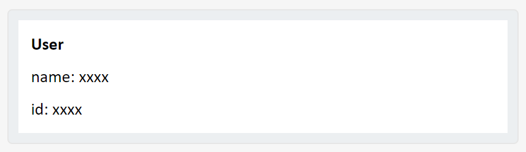

# Swagger/OpenAPI Investigation

OpenAPI Specification (formerly Swagger Specification) is an API description format for REST APIs.

## Example definition
A sample OpenAPI 3.0 definition written in YAML can be found as below:

```yaml
openapi: 3.0.0
info: # Contains API information
  title: Sample API
  description: Optional multiline or single-line description in [CommonMark](http://commonmark.org/help/) or HTML.
  version: 0.1.9
servers: # Specifies the API server and base URL
  - url: http://api.example.com/v1
    description: Optional server description, e.g. Main (production) server
  - url: http://staging-api.example.com
    description: Optional server description, e.g. Internal staging server for testing
paths: # defines individual endpoints (paths), and the HTTP methods (operations) supported by these endpoints.
  /users/{userId}:
    get:
      summary: Returns a user by ID.
      parameters:
        - in: path
          name: userId
          required: true
          schema:
            type: integer
            format: int64
            minimum: 1
      responses:
        '200':
          description: OK
          content:
            application/json:
              schema:
                $ref: '#/components/schemas/User'
  /users:
    post:
      summary: Creates a new user.
      requestBody:
        required: true
        content:
          application/json:
            schema:
              $ref: '#/components/schemas/User'
      responses:
        '201':
          description: Created

components:
  schemas:
    User:
      type: object
      properties:
        id:
          type: integer
          example: 4
        name:
          type: string
          example: Arthur Dent
      # Both properties are required
      required:  
        - id
        - name
```

You can paste the OpenAPI 3.0 definition to [swagger editor](https://editor.swagger.io/) to view the result as below:


## Environment variables

```yaml
openapi: 3.0.0
servers: # Specifies the API server and base URL
  - url: http://{environment}.example.com/v1
    description: Optional server description, e.g. Main (production) server
    
    variables:
      environment:
        default: api    # Production server
        enum:
          - api         # Production server
          - api.dev     # Development server
          - api.staging # Staging server
```


## Parameters

Path Parameters
```yaml
# GET /users/1
paths:
  /users/{id}:
    get:
      parameters:
        - in: path
          name: id   # Note the name is the same as in the path
          required: true
          schema:
            type: integer
            minimum: 1
          description: The user ID
```

Query Parameters
```yaml
# GET /notes?offset=100&limit=50
paths:
  /notes:
    get:
     parameters:
        - in: query
          name: offset
          schema:
            type: integer
          description: The number of items to skip before starting to collect the result set
        - in: query
          name: limit
          schema:
            type: integer
          description: The numbers of items to return
```

Header Parameters

```yaml
# GET /ping HTTP/1.1
# Host: example.com
# X-Request-ID: 77e1c83b-7bb0-437b-bc50-a7a58e5660ac
paths:
  /ping:
    get:
      summary: Checks if the server is alive
      parameters:
        - in: header
          name: X-Request-ID
          schema:
            type: string
            format: uuid
          required: true
```

Cookie Parameters
```yaml
# GET /api/users
# Host: example.com
# Cookie: debug=0; token=BUSe35dohU3O1MZ
paths:
  /users:
    get:
      parameters:
        - in: cookie
          name: debug
          schema:
            type: integer
            enum: [0, 1]
            default: 0
        - in: cookie
          name: token
          schema:
            type: string
```


## Request Body
Request body can contain multiple types
```yaml
paths:
  /pets:
    post:
      summary: Add a new pet
      requestBody:
        description: Optional description in *Markdown*
        required: true
        content:
          application/json:
            schema:
              $ref: '#/components/schemas/Pet'
          application/xml:
            schema:
              $ref: '#/components/schemas/Pet'
          application/x-www-form-urlencoded:
            schema:
              $ref: '#/components/schemas/PetForm'
          text/plain:
            schema:
              type: string
      responses:
        '201':
          description: Created
```

Form data for request body:

`application/x-www-form-urlencoded` is used to send simple ASCII text data as key=value pairs

```yaml
# POST /survey HTTP/1.1
# Host: example.com
# Content-Type: application/x-www-form-urlencoded
# Content-Length: 28

# name=Amy+Smith&fav_number=42

paths:
  /survey:
    post:
      requestBody:
        required: true
        content:
          application/x-www-form-urlencoded:
            schema:
              type: object
              properties:
                name:
                  type: string
                fav_number:
                  type: integer
              required:
                - name
                - email
```

File upload:
```yaml
# POST /upload
# Host: example.com
# Content-Length: 808
# Content-Type: image/png

# [file content goes there]

requestBody:
  content:
    image/png:
      schema:
        type: string
        format: binary
```

Upload file via Multipart Requests:
```yaml
# POST /upload
# Host: example.com
# Content-Length: 2740
# Content-Type: multipart/form-data; boundary=abcde12345
#
# --abcde12345
# Content-Disposition: form-data; name="orderId"
#
# 1195
# --abcde12345
# Content-Disposition: form-data; name="fileName"; filename="attachment.txt"
# Content-Type: text/plain
#
# [file content goes there]
# --abcde12345--

requestBody:
  content:
    multipart/form-data:
      schema:
        type: object
        properties:
          orderId:
            type: integer
          fileName:
            type: string
            format: binary
```

Upload multiple files:
```yaml
# POST /upload
# Host: example.com
# Content-Length: 2740
# Content-Type: multipart/form-data; boundary=abcde12345

# --abcde12345
# Content-Disposition: form-data; name="fileName"; filename="file1.txt"
# Content-Type: text/plain

# [file content goes there]
# --abcde12345
# Content-Disposition: form-data; name="fileName"; filename="file2.png"
# Content-Type: image/png

# [file content goes there]
# ------WebKitFormBoundaryWfPNVh4wuWBlyEyQ
# Content-Disposition: form-data; name="fileName"; filename="file3.jpg"
# Content-Type: image/jpeg

# [file content goes there]
# --abcde12345--

requestBody:
  content:
    multipart/form-data:
      schema:
        type: object
        properties:
          filename:
            type: array
            items:
              type: string
              format: binary
```
## Response Body

A minimal example of response body:

```yaml
paths:
  /ping:
    get:
      responses:
        '200':
          description: OK
          content:
            text/plain:
              schema:
                type: string
                example: pong
```

Response with an image:
```yaml
paths:
  # This operation returns image
  /logo:
    get:
      summary: Get the logo image
      responses:
        '200':
          description: Logo image in PNG format
          content:
            image/png:
              schema:
                type: string
                format: binary
```

Response a json:
```yaml
responses:
  '200':
    description: A User object
    content:
      application/json:
        schema:
          type: object
          properties:
            id:
              type: integer
              description: The user ID.
            username:
              type: string
              description: The user name.
```

Response oneOf schema:
```yaml
responses:
  '200':
    description: A JSON object containing pet information
    content:
      application/json:
        schema:
          oneOf:
            - $ref: '#/components/schemas/Cat'
            - $ref: '#/components/schemas/Dog'
            - $ref: '#/components/schemas/Hamster'
```

Response headers:
```yaml
paths:
  /ping:
    get:
      summary: Checks if the server is alive.
      responses:
        '200':
          description: OK
          headers:
            X-RateLimit-Limit:
              schema:
                type: integer
              description: Request limit per hour.
            X-RateLimit-Remaining:
              schema:
                type: integer
              description: The number of requests left for the time window.
            X-RateLimit-Reset:
              schema:
                type: string
                format: date-time
              description: The UTC date/time at which the current rate limit window resets.
```

## Describing Security

```yaml

paths:
  /billing_info:
    get:
      summary: Gets the account billing info
      security:
        - OAuth2: [admin]   # Use OAuth with a different scope
      responses:
        '200':
          description: OK
        '401':
          description: Not authenticated
        '403':
          description: Access token does not have the required scope
  /ping:
    get:
      summary: Checks if the server is running
      security: []   # No security
      responses:
        '200':
          description: Server is up and running
        default:
          description: Something is wrong

components:
  securitySchemes:
    BasicAuth:
      type: http
      scheme: basic
    BearerAuth:
      type: http
      scheme: bearer
    ApiKeyAuth:
      type: apiKey
      in: header
      name: X-API-Key
    OpenID:
      type: openIdConnect
      openIdConnectUrl: https://example.com/.well-known/openid-configuration
    OAuth2:
      type: oauth2
      flows:
        authorizationCode:
          authorizationUrl: https://example.com/oauth/authorize
          tokenUrl: https://example.com/oauth/token
          scopes:
            read: Grants read access
            write: Grants write access
            admin: Grants access to admin operations
```

## Swagger Parser SDK
There is a swagger parser SDK which can parse swagger yaml file, the sample usage can be as below:

```js
const SwaggerParser = require("@apidevtools/swagger-parser");

async function parse(){
  try {
    let api = await SwaggerParser.validate(__dirname +"/openapi.yaml");
    console.log("API name: %s, Version: %s", api.info.title, api.info.version);

    console.log(JSON.stringify(api));
  }
  catch(err) {
    console.error(err);
  }
}

parse();
```


## Ideas

### Generate Adaptive Cards through API definition for requests

Generate adaptive card for each API request:

- Input a Swagger definition file

- Select some APIs

- Analyze the API definition for operation, parameters, request body, security information and so on, and generate an adaptive card.

- Generate code for backend bot

### Example
Use the yaml file below as example:
```yaml
openapi: 3.0.0
info: # Contains API information
  title: Sample API
  description: Optional multiline or single-line description in [CommonMark](http://commonmark.org/help/) or HTML.
  version: 0.1.9
servers: # Specifies the API server and base URL
  - url: http://api.example.com/v1
    description: Optional server description, e.g. Main (production) server
  - url: http://staging-api.example.com
    description: Optional server description, e.g. Internal staging server for testing
paths: # defines individual endpoints (paths), and the HTTP methods (operations) supported by these endpoints.
  /users/{userId}:
    get:
      summary: Returns a user by ID.
      parameters:
        - in: path
          name: userId
          required: true
          schema:
            type: integer
            format: int64
            minimum: 1
      responses:
        '200':
          description: OK
          content:
            application/json:
              schema:
                $ref: '#/components/schemas/User'
  /users:
    post:
      summary: Creates a new user.
      requestBody:
        required: true
        content:
          application/json:
            schema:
              $ref: '#/components/schemas/User'
      responses:
        '201':
          description: Created

components:
  schemas:
    User:
      type: object
      properties:
        id:
          type: integer
          example: 4
        name:
          type: string
          example: Arthur Dent
      # Both properties are required
      required:  
        - id
        - name
```

The adaptive cards generate is as below:


```json
{
    "type": "AdaptiveCard",
    "body": [
        {
            "type": "TextBlock",
            "text": "GET: /users/{userId} \nReturns a user by ID.",
            "wrap": true,
            "color": "Dark",
            "weight": "Bolder"
        },
        {
            "type": "TextBlock",
            "text": "Servers",
            "wrap": true
        },
        {
            "type": "Input.ChoiceSet",
            "choices": [
                {
                    "title": "http://api.example.com/v1",
                    "value": "http://api.example.com/v1"
                },
                {
                    "title": "http://staging-api.example.com",
                    "value": "http://staging-api.example.com"
                }
            ],
            "placeholder": "Select Server",
            "value": "http://api.example.com/v1"
        },
        {
            "type": "Input.Text",
            "placeholder": "UserId",
            "label": "UserId",
            "id": "UserId"
        },
        {
            "type": "ActionSet",
            "actions": [
                {
                    "type": "Action.Execute",
                    "title": "GET"
                }
            ]
        }
    ],
    "$schema": "http://adaptivecards.io/schemas/adaptive-card.json",
    "version": "1.5"
}
```


```json
{
    "type": "AdaptiveCard",
    "body": [
        {
            "type": "TextBlock",
            "text": "POST: /users Creates a new user.",
            "wrap": true,
            "weight": "Bolder"
        },
        {
            "type": "TextBlock",
            "text": "Servers",
            "wrap": true
        },
        {
            "type": "Input.ChoiceSet",
            "choices": [
                {
                    "title": "http://api.example.com/v1",
                    "value": "http://api.example.com/v1"
                },
                {
                    "title": "http://staging-api.example.com",
                    "value": "http://staging-api.example.com"
                }
            ],
            "placeholder": "Select Server",
            "value": "http://api.example.com/v1"
        },
        {
            "type": "Input.Text",
            "placeholder": "id",
            "label": "id",
            "id": "id"
        },
        {
            "type": "Input.Text",
            "placeholder": "name",
            "label": "name",
            "id": "name"
        },
        {
            "type": "ActionSet",
            "actions": [
                {
                    "type": "Action.Execute",
                    "title": "POST"
                }
            ]
        }
    ],
    "$schema": "http://adaptivecards.io/schemas/adaptive-card.json",
    "version": "1.5"
}
```

User structure adaptive card:



```json
{
    "type": "AdaptiveCard",
    "body": [
        {
            "type": "TextBlock",
            "text": "User",
            "wrap": true,
            "color": "Dark",
            "weight": "Bolder"
        },
        {
            "type": "TextBlock",
            "text": "name: xxxx",
            "wrap": true
        },
        {
            "type": "TextBlock",
            "text": "id: xxxx",
            "wrap": true
        }
    ],
    "$schema": "http://adaptivecards.io/schemas/adaptive-card.json",
    "version": "1.5"
}
```


From bot chat window, user can input two command:
```bash
GET /users/{userId}
POST /users
```

For command `GET /users/{userId}`, it will response with the adaptive card below:


And when user click `GET` button, it will response with the adaptive card as below:


For command `POST /users`, it will response with the adaptive card as below:


And when user click `POST` button, it will response with a message:

```
201: Created
```

### Some limitations
- Adaptive Card doesn't support File upload, and some APIs with binary file upload may not support: https://github.com/microsoft/AdaptiveCards/issues/5844

- Adaptive Card action has its own payload as below and cannot call API directly throw action buttons, so we need to call APIs from Bot backend and then sent back to Teams:
  ```json
  {
    "text":"text to bots",
    "type":"message",
    "value":{
        "prop1": "1",
        "prop2": "2"
    },
    ...
  }
  ```

- Swagger definition doesn't contain detailed information such as `userName`, `password`, `clientId` and `clientSecret` for authorization, and we need these information to construct API calls. 

- There are so many request and response types such as JSON, XML, form data, plain text, binary and others, and it is not easy to support all the types, maybe we should narrow down the support to json.

- For JSON request and response, if JSON is complex and has nested properties, it is not easy to generate corresponding adaptive card.


